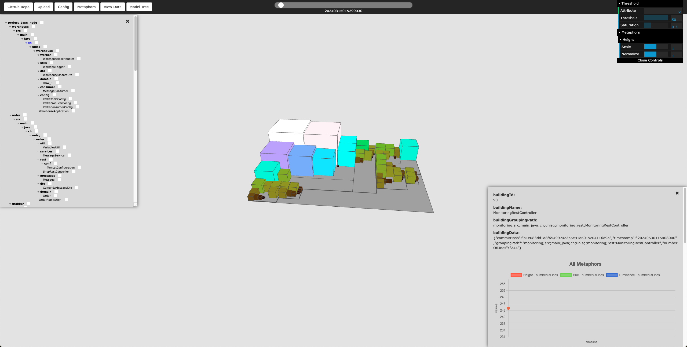
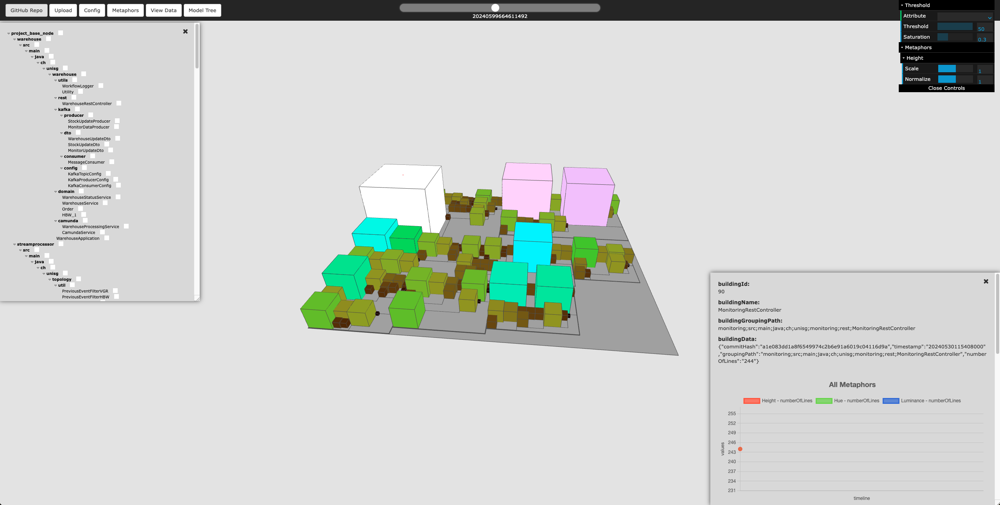

# Summer Extension - Week 3

Here, you can see what the tool currently produces, when I provide the URL of this semesters' EDPO project to it. As of now, height, color-hue, and color-luminance are all set to the code metric "linesOfCode". The first screenshot displays a very early commit, the second screenshot displays a later commit of the development process. (note: I think it would be neccessary to somewhere display the commit number of the current displayed city).

This week I have implemented a way of reading a GitHub repository. The workflow of the implemented functionality is described as follows:

-  Provide a URL of a GitHub repository to the tool
-  The node server of the tool clones the repository into a local directory (./temp_repositories)
-  Retrieve all individual commits of the repository
-  Iterate through the commit history chronologically
   -  Calculate code metrics on every commit
   -  Write the metrics for every commit to a .csv file in the correct format
-  Provide the .csv file to the client
-  Remove the cloned repository from the local directory, including also the .csv file
-  The client downloads the .csv file
-  From here, everything is the same, as if you would upload your own .csv file to the tool

I realize, that the workflow that I have modelled two weeks ago suddenly makes a lot of sense to also include it now. Because the calculation of the code metrics takes quite some time (e.g. this semesters' EDPO project with 299 commits took about 3 minutes), it would be cool to only have to perform this calculation once. Therefore, I think it makes sense to download the computed .csv file and upload it to the GitHub repository inside the previously described folder "metrics", which is used to place pre computed code metric files and accessed by the software city tool. This would have the benefit of not needing to calculate code metrics all over again.

Because visualizing a software city for a GitHub repository differs from visualizing a e.g. eye-tracking experiment, I needed to further fix/improve the upload data type "Java Source Code". At the moment it works as expected, but there are still a couple of bugs, especially regarding the model tree and with the dat.gui GUI. Additionally it seems that the normalizing of the software city visualization (i.e. shrinking size of buildings, if values are really huge) isn't working properly. Also the info charts if you click on a building are not making a lot of sense if they are implemented the same way as for the eye-tracking experiment data type. But I don't really know, if it is worth spending time on that.

In the upcoming days I will mainly focus on fixing all of the bugs in the Java Source Code visualization, and improve the whole workflow of the tool (including combining the two workflows: providing an URL of a repo, and select a pre-registred repo from the drop-down list).
Also, Thierry has given me feedback about his part of the tool. It looks like it is almost done, but I will invest some time into a pattern that Thierry suggested me that I could use for some parts of the implementation.

In general while I think there is still substential work to do, the implementation is on a good way. I think I would need 1 more week for implementation and then another week to refactor the whole code base. After that, I can start working on a "paper-like" report, as discussed with Amine.
