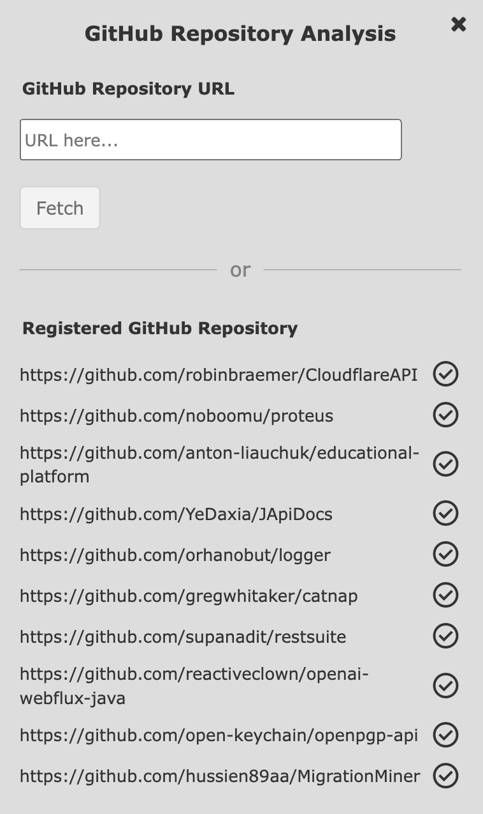
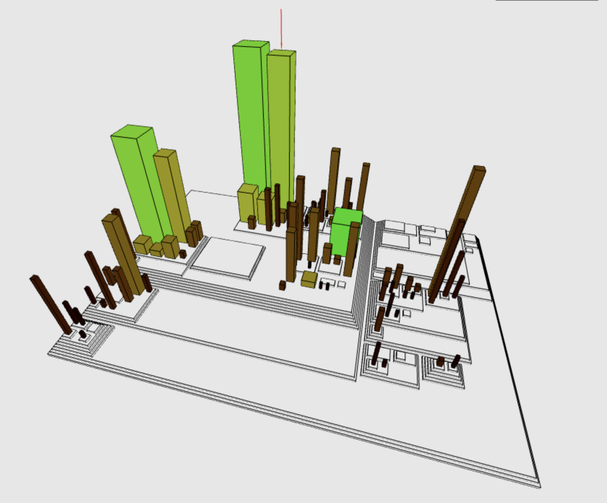

# Summer Extension - Week 8

Here are the links to the individual branches of the project:
- [Status of the project for Thierry](https://github.com/jonaslanzlinger/software-city-project/tree/v2.0.0)
- [Status of the Git extension](https://github.com/jonaslanzlinger/software-city-project)
- [Status of the old project, including all previous approaches to software city](https://github.com/jonaslanzlinger/software-city-project/tree/js-implementation_v1.0.0)

This week, I have worked on the following tasks:
- [x] only load metrics to frontend, when repository has been selected for analysis
- [x] only load repository data, when github frame is open
- [x] only load metrics into memory in backend service, when repository has been selected for analysis
- [x] adjust y-pos of buildings, such that they are not overlapping with the planes
- [x] fix experiment data type visualization (issue with field separator)
- [x] fix color picker appearance
- [x] when clicking on element in the model tree, draw indicator arrow over corresponding element in 
visualization and highlight element in model tree
- [x] when clicking on element in visualization, highlight corresponding element in model tree
- [x] when clicking on element in visualization, jump to corresponding element in model tree
- [x] fix hovering issue in model tree
- [x] display commit hash somewhere
- [x] insert download button for currently loaded data in the "View Data" tab 
- [x] check, if charts are displayed correctly
- [x] check, if buildings are displayed correctly
- transmitting of metrics from metrics-computation-service to backend via chunks to avoid request payload size limit
- still some issues with lag, if lots of data points in metrics file (maybe reduce clutter in charts)

After these tasks, I will start answering the following questions, using the tool:
- What questions can we answer with this tool?
- What tool features allow us to answer these questions?
- What are answers for these questions on the example of a given repository?
- Note: The answers need to bring some business value. Organize the questions and answers into themes.

# Analysis

## Repositories
- Repo 1: CloudflareAPI (https://github.com/robinbraemer/CloudflareAPI)
- Repo 2: Proteus (https://github.com/noboomu/proteus)
- Repo 3: Educational-Platform (https://github.com/anton-liauchuk/educational-platform)
- Repo 4: JApiDocs (https://github.com/YeDaxia/JApiDocs)
- Repo 5: Logger (https://github.com/orhanobut/logger)
- Repo 6: Catnap (https://github.com/gregwhitaker/catnap)
- Repo 7: Roboslack (https://github.com/palantir/roboslack)
- Repo 8: Restsuite (https://github.com/supanadit/restsuite)
- Repo 9: OpenAI-webflux-java (https://github.com/reactiveclown/openai-webflux-java)
- Repo 10: OpenPGP-Api (https://github.com/open-keychain/openpgp-api)
- Repo 11: MigrationMiner (https://github.com/hussien89aa/MigrationMiner)

I will choose one or more of the above repositories, because the to-be-analyzed repo should be medium-size, 
written 
in Java, easy to understand, and expose some interesting insights. To choose the best repository, all repos 
have been analyzed, and loaded into the tool's database.

## Analysis Procedure

In the next step, I have opened the visualization of each repository in the tool, to see, if anything 
interesting is observable. The analysis is grouped in 4 topics, where each topic answers one specific 
family of questions. The topics are:

- Bird-eye view
- God classes
- Complex classes

## Analysis Results 

### Bird-eye view

For obtaining a broad overview of the repository, including the evolution of the code base, I have used 
the following procedure:

- Load repository
- To get a feeling of the size of the components:
  - Size: "LOC"
  - Height: "LOC"
- Scroll through the timeline, to see high-volatile areas
- Firstly, it is necessary to keep in mind, that during the development process some components might get
  renamed, moved, deleted, or new components are created. This is visible by scrolling through the timeline.
- Next, look for extreme "LOC" values in the timeline, and find the commits before and after the comment 
  in which the "LOC" value has drastically changed. When those boundary commits have been found, 
  further drill down, by having a look at the changes in the code, to see what has been changed.
- Build overview by looking at the city:
  - Identify high-volatile areas
  - Identify key components
  - Obtain feeling of the size of the components
  - Identify which classes are grouped together
  - Identify which components have been created / deleted / renamed

Going through the procedure described above, I have found the following things, using the software city tool.

Example Repository: CloudflareAPI (https://github.com/robinbraemer/CloudflareAPI)

In the current state, the repository is not very big, and the visualization is easy to understand.
The repository has had three "main" classes: "UserService", "DNSRecordService", and "ZoneService". Those 
services got deleted in the commit number 28, and never reappeared. This is a clear indicator, that the
repository has been refactored, and the services have been moved to another location.
In the current state, the system is composed of one main package "objects" that contains definitions for 
object types and how they should be represented. The granularity of the components is very high, as all 
the city buildings are about the same height. This suggests, that the components are very similar in size.

Limitations:
- if code components get renamed, they will reappear somewhere different in the visualized city. This 
  imposes a problem, as this suggests that something has changed, while in reality only the name of the 
  super folder could have changed. There must be a way how to mitigate this problem by somehow match 
  components together that just have been renamed or similar.
  - Example: You can see that perfectly in this repository, where you have in the complete model tree 
    structure three directories that are named "cloudflare", or "cloudflare_old". Between the commit 
    numbers 13 and 14, the folder structure has changed from "cloudflare/..." to "src/...". Between The 
    commit number 27, it becomes clear, that refactoring has been done, as the "cloudflare" folder has
    been renamed to "cloudflare_old". This is a perfect example, where the tool could be improved, by
    matching the components together, that have been renamed.

### God classes

Next, I have investigated the repositories for god classes. God classes are classes that are doing too
much, and are violating the single responsibility principle. God classes don't necessarily have high "LOC" 
values. For example, a class that is doing too many unrelated small things, might have a low "LOC" value,
but is still a god class. To find god classes, I want to bring two metrics into proportion: "LOC" and 
"CBO". By this, I set the size of the buildings to the metric "LOC", and the height of the buildings to
the metric "CBO". This way, if a class has a high "CBO" value compared to the "LOC" value, it is likely a
god class.

Example Repository: JApiDocs (https://github.com/YeDaxia/JApiDocs)

In the screenshot below you can see the resulting visualization.

Setting the timeline at the complete end, reveals that the buildings are rather high, while the size is
small. This suggests, that there is a tendency to classes with proportionally high cbo values compared to
the loc values, which leads to my conclusion, that there must be some god classes.

The highlighted building in the screenshot is the [SpringControllerParser](https://github.com/YeDaxia/JApiDocs/blob/4b92eee3be6a79d49d394253b17c9442c9c337c8/library/src/main/java/io/github/yedaxia/apidocs/parser/SpringControllerParser.java) class. After copying the commitHash, and have a
look at the class code, it becomes clear, that this is definitely a god class as it displays the
following characteristics:
- Amount of responsibilities: The class is doing too much - handling controller annotations, handling
  method annotations, parsing request parameters, handling responses, and even converting data types. In
  that sense, it is violating the single responsibility principle.
- Operations on various objects: The class is working with several different types of objects, and is
  performing many operations on them. These operations should be split up into multiple different
  controllers and parsers.
- Dependency on other classes: Regarding the separation of concern, the handling of spring annotations
  should be separated from the parsing logic and specific parts be delegated to dedicated classes.
- Conclusion: This class is a god class, and should be refactored.

### Complex classes

Complex classes are classes that are unnecessarily complex, and are hard to understand. To find complex 
classes, I utilized the metrics described in the CK Metrics Suite. 
In this next example, I want to display how to find modules or classes inside the to-be-analyzed
repository that are not optimal, using the (CK Metrics Suite)[https://medium.com/@benkaddourmed54/analyzing-ck-metrics-results-and-quality-assessment-a70ba56534f0]. 
The CK Metrics Suite consists of the following six metrics:
- 
- CBO: Coupling between object classes
- DIT: Depth of inheritance tree
- LCOM*: Lack of cohesion in methods (LCOM* is a slightly modified version of the standard LCOM metric, 
  giving values between 0 and 1)
- NOC: Number of children
- RFC: Response for a class
- WMC: Weighted method count

While using single metrics alone can already be useful, this might not always lead to the best results,
and could be misleading. For example a class that highly relies on external libraries, might have a very
high CBO metric value, but isn't necessarily complex. Also, utility classes are typically very simple to
understand, but have a high CBO value nonetheless (regardless whether it conforms with the single 
responsibility principle).
Therefore, it might be even more valuable to combine multiple metrics in the visualization.
I have come up with 3 metric combinations, that tackle 3 individual use-cases:

#### Identify classes with multiple high metrics
Classes with high values in multiple metrics are likely "hot spots" in the code, and should be
addressed first for refactoring. To achieve this, I set the size of the building to the metric 
CBO, the height of the building to the metric RFC, and the color-hue to the metric WMC. This way, 
classes with high values in all three metrics will be displayed BIG, TALL, and in DARK RED COLOR. 
Because we always want to tackle the "big fish" first, I  also set the LOC metric to the 
color-lightness. This way, if a class has a low LOC value, the building will be displayed in a LIGHT 
RED COLOR, and we can ignore it for now.

#### Identify classes with complex logic
When looking at bare complexity metrics, this does not give enough information, whether a class is
indeed too complex. It needs to be brought into proportion, e.g. with the size. Therefore, if a class 
has both high RFC and high WMC values, it is likely that the class is too complex (from the logic 
point of view). To achieve this, I have set the size of the building to the metric RFC, the height to 
the metric WMC, and the color-hue, as well as the color-lightness to the metric LOC. This way, if a 
building is too complex, it will be displayed BIG, TALL, and in "some" color (see limitations). 
Depending on the size of the class, this color will be different.

Limitations: Sometimes it would be useful to use static constant values for one city metaphor feature. 
As described above, the color-hue and color-lightness are set to the metric LOC. This means, that the 
color-hue is displaying the same information as the color-lightness feature. It is not an issue, but 
adds unnecessary complexity to the visualization. A workaround could be to add static constant values, 
that are selectable in the Metaphor Mapping tab, to have a more clear visualization.

#### Identify class with low cohesion:
  - High LCOM* combined with other metrics like CBO suggest that a class is doing too much unrelated
    things. Therefore, it might be subject for refactoring with the goal of high cohesion and single
    responsibility. To achieve this, I have set the size of the building to the metric LCOM*, the height
    to the metric CBO, and the color-hue, and the color-lightness to the metric LOC. This way, if a class has
    low cohesion, it will be displayed BIG, TALL, and in "some" color (see limitations above). Depending
    on the lightness of the color, the refactoring of this class has probably a higher or lower priority.

Repository: Logger (https://github.com/orhanobut/logger)

